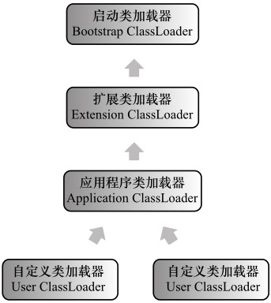

# Java 类加载

`Java`语言的类型可以分为两大类：基本类型`primitive types`和引用类型`reference types`。

引用类型细分为四种：类、接口、数组类和泛型参数。泛型参数会在编译过程中被擦除，`Java`虚拟机实际上只有前三种。

在类、接口和数组类中，数组类是由`Java`虚拟机直接生成的，其他两种则需要加载二进制字节流。

二进制字节流，最常见的形式要属由`Java`编译器生成的`class`文件。除此之外，我们也可以在程序内部直接生成，或者从网络中获取`Java applet`字节流。这些不同形式的字节流，都会被加载到`Java`虚拟机中，成为类或接口。

无论是直接生成的数组类，还是加载的类，`Java`虚拟机都需要对其进行链接和初始化。

## 加载

加载，是指查找字节流，并且据此创建类的过程。对于数组类来说，它并没有对应的字节流，而是由`Java`虚拟机直接生成的。对于其他的类来说，`Java`虚拟机则需要借助类加载器来完成查找字节流的过程。

启动类加载器`Bootstrap ClassLoader`。启动类加载器是由`C++`实现的，没有对应的`Java`对象，因此在`Java`中只能用`null`来指代。

除了启动类加载器之外，其他的类加载器都是`java.lang.ClassLoader`的子类，因此有对应的`Java`对象。这些类加载器需要先由另一个类加载器，比如说启动类加载器，加载至`Java`虚拟机中，方能执行类加载。

**双亲委派模型**：在`Java`虚拟机中，每当一个类加载器接收到加载请求时，它会先将请求转发给父类加载器。在父类加载器没有找到所请求的类的情况下，该类加载器才会尝试去加载。

除了由`Java`核心类库提供的类加载器外，我们还可以加入自定义的类加载器，来实现特殊的加载方式。我们可以对`class`文件进行加密，加载时再利用自定义的类加载器对其解密。

在`Java`虚拟机中，类的唯一性是由类加载器实例以及类的全限定名一同确定的。即便是同一串字节流，经由不同的类加载器加载，也会得到两个不同的类。

## 链接

链接，是指将创建成的类合并至`Java`虚拟机中，使之能够执行的过程。它分为验证、准备以及解析三个阶段。

**验证**

确保被加载类能够满足`Java`虚拟机的约束条件。

**准备**

为被加载类的静态字段分配内存。

**解析**

在`class`文件被加载至`Java`虚拟机之前，这个类无法知道其他类及其方法、字段所对应的具体地址，甚至不知道自己方法、字段的地址。

因此，每当需要引用这些成员时，`Java`编译器会生成一个符号引用。在运行阶段，这个符号引用一般都能够无歧义地定位到具体目标上。

举例来说，对于一个方法调用，编译器会生成一个包含目标方法所在类的名字、目标方法的名字、接收参数类型以及返回值类型的符号引用，来指代所要调用的方法。

解析阶段的目的，正是将这些符号引用解析成为实际引用。如果符号引用指向一个未被加载的类，或者未被加载类的字段或方法，那么解析将触发这个类的加载（但未必触发这个类的链接以及初始化）。

## 初始化

如果直接赋值的静态字段被`final`所修饰，并且它的类型是基本类型或字符串时，那么该字段便会被`Java`编译器标记成常量值`ConstantValue`，其初始化直接由`Java`虚拟机完成。

除此之外的直接赋值操作，以及所有静态代码块中的代码，则会被`Java`编译器置于同一方法中，并把它命名为`<clinit>`。

类加载的最后一步是初始化，便是为标记为常量值的字段赋值，以及执行`<clinit>`方法的过程。`Java`虚拟机会通过加锁来确保类的`<clinit>`方法仅被执行一次。

只有当初始化完成之后，类才正式成为可执行的状态。

类的初始化何时会被触发呢？

1. 当虚拟机启动时，初始化用户指定的主类；
2. 当遇到用以新建目标类实例的`new`指令时，初始化`new`指令的目标类；
3. 当遇到调用静态方法的指令时，初始化该静态方法所在的类；
4. 当遇到访问静态字段的指令时，初始化该静态字段所在的类；
5. 子类的初始化会触发父类的初始化；
6. 如果一个接口定义了`default`方法，那么直接实现或者间接实现该接口的类的初始化，会触发该接口的初始化；
7. 使用反射`API`对某个类进行反射调用时，初始化这个类；
8. 当初次调用`MethodHandle`实例时，初始化该`MethodHandle`指向的方法所在的类。