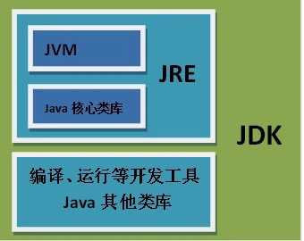

# 准备工作

## Java

`Java`作为一门跨平台的高级语言，一次编写，到处运行。`Java`通过`Java`虚拟机的形式来屏蔽底层硬件、操作系统实现，向上提供了统一`API`，进而实现跨平台特性。

开发人员通过高级语言编写`java`源文件，`javac`将源代码编译为`class`字节码文件，`JVM`解释执行`class`文件。

要使用`Java`，需要安装`JDK`，请参考文章：[JDK安装 - 看云](https://www.kancloud.cn/yunzhiclub/springboot_angular_guide/1287227)。

`Java Development Kit`：`Java`开发工具包，包含了执行`Java`代码的虚拟机、`Java`的核心类库以及`Java`编译运行的开发工具。

## MAVEN

假设

## IDEA