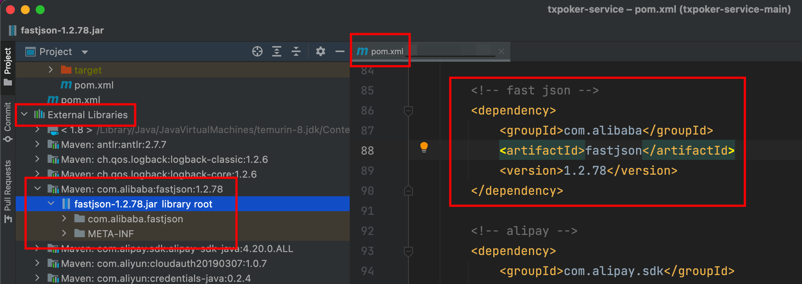

# 准备工作

## Java

`Java`作为一门跨平台的高级语言，一次编写，到处运行。`Java`通过`Java`虚拟机的形式来屏蔽底层硬件、操作系统实现，向上提供了统一`API`，进而实现跨平台特性。

开发人员通过高级语言编写`java`源文件，`javac`将源代码编译为`class`字节码文件，`JVM`解释执行`class`文件。


要使用`Java`，需要安装`JDK`，请参考文章：[JDK安装 - 梦云智](https://www.kancloud.cn/yunzhiclub/springboot_angular_guide/1287227)。

`Java Development Kit`：`Java`开发工具包，包含了执行`Java`代码的虚拟机、`Java`的核心类库以及`Java`编译运行的开发工具。


命令行中，执行`java -version`，出现类似如下结果，安装成功。

```shell
➜  ~ java -version
openjdk version "1.8.0_312"
OpenJDK Runtime Environment (Temurin)(build 1.8.0_312-b07)
OpenJDK 64-Bit Server VM (Temurin)(build 25.312-b07, mixed mode)
```

## Maven

`Apache Maven`是常用的`Java`项目管理工具，通过`POM`文件可以管理项目的构建、发布。

如果你用过其他语言项目的包管理器，可能更容易理解：`Java`的`Maven`，类似于`php`的`compose`、`Node.js`的`npm`等等。

一个标准的`Maven`项目结构如下：

```shell
.
├── pom.xml              # 项目POM文件
└── src                  # 源代码
    ├── main             # 源代码包
    │   └── java
    └── test             # 单元测试源代码包
        └── java
```

在没有`Maven`的年代，项目的依赖都是开发者都是去开源网站上下载一个个`jar`包，并在`IDE`中手动引入，非常复杂，感兴趣的可以参考博客：[不通过maven，idea中对jar包的管理](https://blog.csdn.net/xml1996/article/details/104088935)

有了`Maven`，我们不需要手动去管理依赖了，所有的开源`java`项目，都通过`mvn deploy`将包发布到[Maven 中央仓库](https://mvnrepository.com/)，在进行`jar`包时，只需要在`pom.xml`文件中声明对包的依赖。

如果需要使用`fastjson`，在`pom`中声明`groupId`、`artifactId`、`version`，可以根据这三个项唯一确定一个`jar`包，`Maven`会自动去中央仓库进行包下载，并构建到项目中，如下图：



*注：为了避免冲突，一般规范中，`groupId`为组织域名的反写，`artifactId`为组织内唯一项目名。*

`Maven`安装，请参考文章：[MAVEN安装 - 梦云智](https://www.kancloud.cn/yunzhiclub/springboot_angular_guide/1287228)。

命令行中，执行`mvn -version`，出现类似如下结果，安装成功。

```shell
➜  ~ mvn -version
Apache Maven 3.8.3 (ff8e977a158738155dc465c6a97ffaf31982d739)
Maven home: /opt/homebrew/Cellar/maven/3.8.3/libexec
Java version: 1.8.0_312, vendor: Temurin, runtime: /Library/Java/JavaVirtualMachines/temurin-8.jdk/Contents/Home/jre
Default locale: zh_CN, platform encoding: UTF-8
OS name: "mac os x", version: "10.16", arch: "x86_64", family: "mac"
```

## IDEA

`IDEA`，是`JetBrains`的明星产品，是一款优秀的`Java`集成开发环境。

`IDEA`安装，请参考文章：[IDEA安装 - 梦云智](https://www.kancloud.cn/yunzhiclub/springboot_angular_guide/1287229)。

软件激活请参考：[JetBrains全系列软件激活教程激活码以及JetBrains系列软件汉化包 - MacWk](https://www.macwk.com/article/jetbrains-crack)