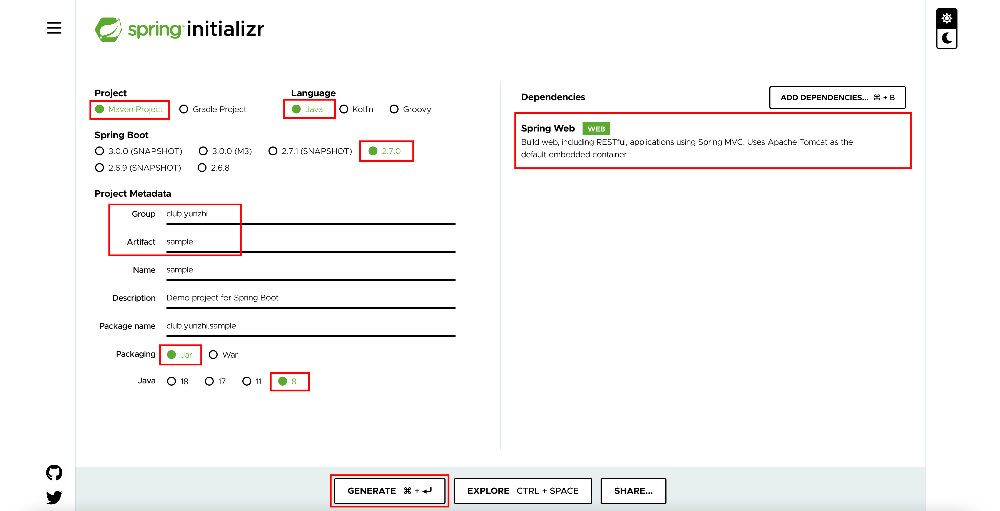
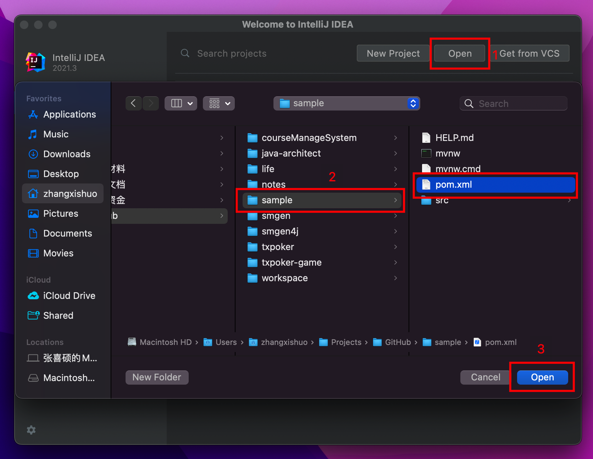
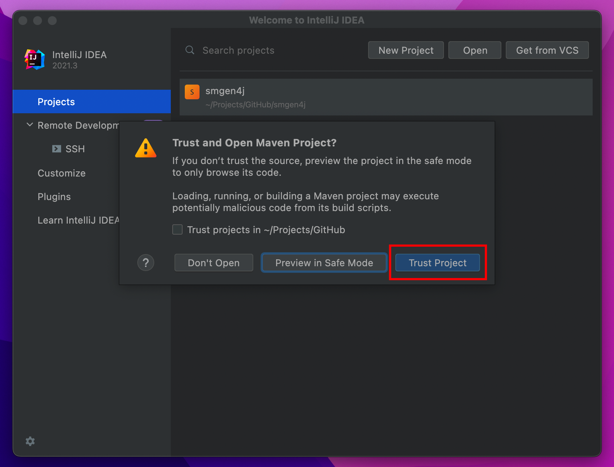
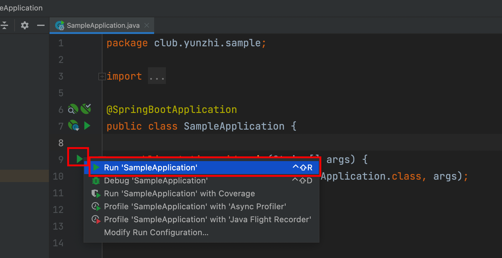
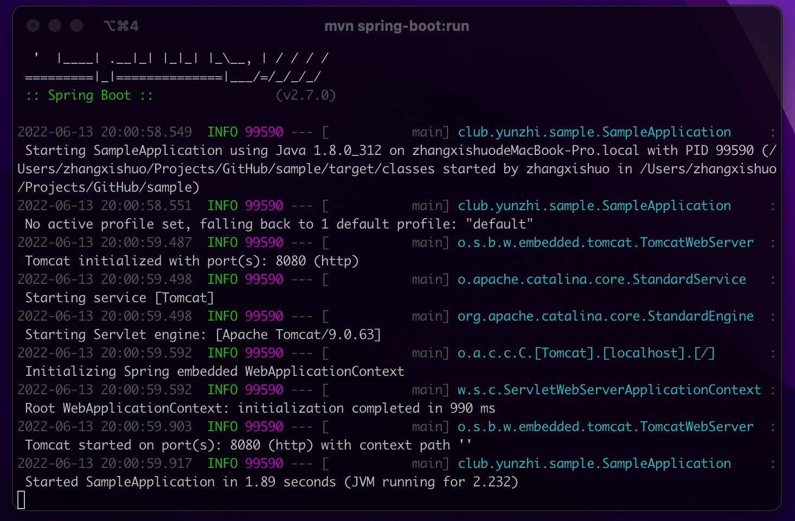

# Hello World

## Spring Initializr

打开[spring initializr](https://start.spring.io/)，可以非常方便地创建一个`Spring Boot`项目。

依次按照下图示例进行选择，右侧依赖点击`ADD DEPENDENCIES`按钮，在弹窗中选择`Spring Web`。

点击`GENERATE`按钮下载项目。



下载为`zip`压缩包，进行解压。


## 目录结构

这是一个标准的`Maven`项目，可以通过`tree`命令查看`sample`项目的目录结构。

```shell
➜  sample tree
.
├── HELP.md                                             # 帮助文档
├── mvnw                                                # Unix下的Maven工具 已经安装Maven可忽略
├── mvnw.cmd                                            # Windows下的Maven工具 已经安装Maven可忽略
├── pom.xml                                             # Maven 项目的 POM 文件
└── src                                                 # 源代码
    ├── main
    │   ├── java
    │   │   └── club
    │   │       └── yunzhi
    │   │           └── sample
    │   │               └── SampleApplication.java      # Spring Boot 启动类
    │   └── resources
    │       ├── application.properties                  # Spring Boot 配置文件
    │       ├── static                                  # 静态资源
    │       └── templates                               # 模板 可忽略
    └── test                                            # 测试源代码
        └── java
            └── club
                └── yunzhi
                    └── sample
                        └── SampleApplicationTests.java # 单元测试

14 directories, 7 files
```

## 启动 Spring Boot

### IDEA 启动

启动`IDEA`，选择`Open`，选择`sample`目录下的`pom.xml`文件，点击`Open`。



选择`Open as Project`。


选择`Trust Project`。



`IDEA`打开项目后，会自动下载`Maven`依赖，如果没有自动引入，可以在`pom.xml`上右键，选择`Maven -> Reload Project`来手动导入`Maven`依赖。

下载好的`Maven`库会显示在左侧的`External Libraries`中。


打开`SampleApplication`文件，在`main`方法左边的绿色三角号为启动按钮。


点击启动，选择`Run SampleApplication`。



下方控制台打印日志，类似`Started SampleApplication in 0.56 seconds (JVM running for 1.012)`说明应用启动成功。恭喜你启动了第一个`Spring Boot`应用。


### Maven 命令行启动

命令行进入`sample`目录，执行命令`mvn spring-boot:run`，同样可以启动项目。



### Jar 包启动