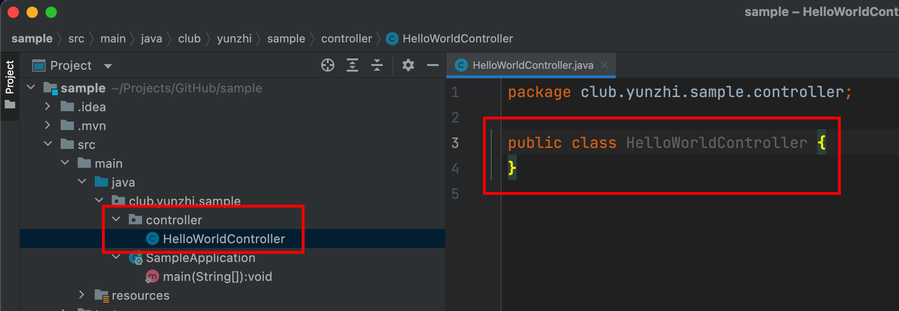

# Hello World

## API 接口

在目前主流的前后台分离架构中，`Spring Boot`作为后端，主要职责为向前端提供`HTTP`接口功能。


业界一般称呼后端提供的接口为`API`，有许多开放的免费`API`可以使用，可以访问[https://api.apiopen.top/api/getImages?page=0&size=2](https://api.apiopen.top/api/getImages?page=0&size=2)，以获取随机图片推荐。

访问上面的接口，我们得到一个如下格式的`JSON`报文结构，`{}`花括号代表对象，`[]`代表数组，`:`展示键值对关系。详细介绍请参考：[JSON - 维基百科](https://zh.m.wikipedia.org/zh/JSON)

```json
{
  "code": 200,
  "message": "成功!",
  "result": {
    "total": 19080,
    "list": [
      {
        "id": 16849,
        "title": "冬天 雪 羊 动物 8K图片",
        "url": "https://pic.netbian.com/uploads/allimg/170704/213333-1499175213e249.jpg",
        "type": "animal"
      },
      {
        "id": 8607,
        "title": "英雄联盟LOL泳池派对 奥",
        "url": "https://pic.netbian.com/uploads/allimg/200616/222519-1592317519426b.jpg",
        "type": "game"
      }
    ]
  }
}
```

## Hello World

参考上面的图片推荐`API`，我们可以在本地实现一个响应`Hello World`的`API`。

请求地址：GET http://本机/HelloWorld

响应结果：

```json
{
  "code": 200,
  "message": "成功!",
  "result": "Hello World"
}
```

在`IDEA`中新建`controller`包，新建`HelloWorldController`类。



```java
@RestController
public class HelloWorldController {
}
```

```java
@RequestMapping("HelloWorld")
public Map<String, Object> helloWorld() {
    Map<String, Object> map = new HashMap<>();
    map.put("code", 200);
    map.put("message", "成功!");
    map.put("result", "Hello World");
    return map;
}
```