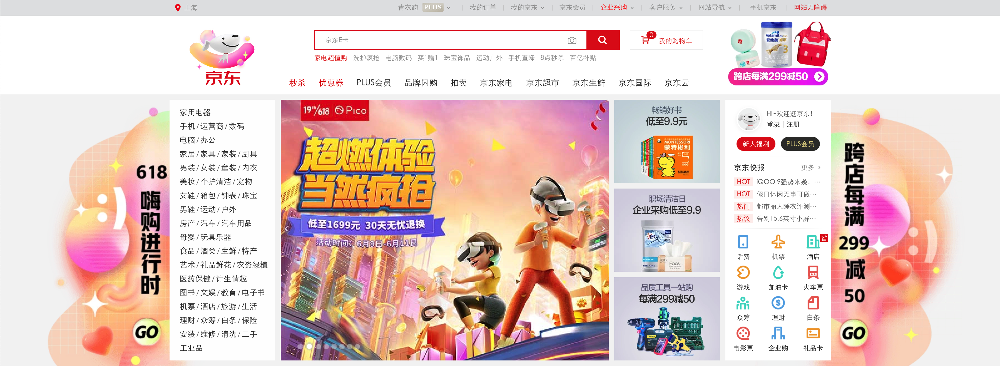
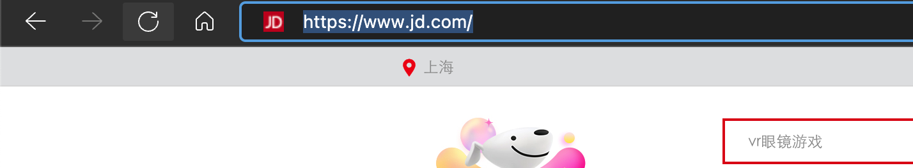
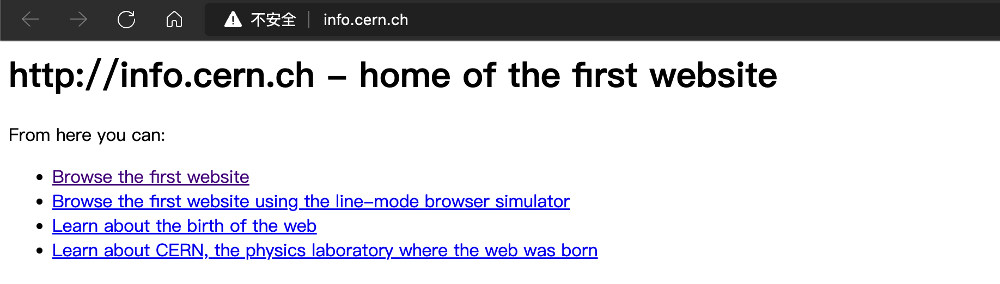

# 引言

## Web 技术发展

每年的`618`、双`11`一直是电商网站最忙碌的时候，电商网站就是一个经典的`Web`应用，从世界上的第一个网站，到如今高并发、高可用的`Web`应用，这其中，经历了怎样的演变呢？



## World Wide Web



`Tim Berners-Lee`蒂姆·伯纳斯-李提出了`World Wide Web`万维网，并于`1991`年创造了全世界的第一个网站：[info.cern.ch](http://info.cern.ch)。

打开网站，仅有简单的静态`HTML`，这是最初的网站形式——静态网站。



## Web 2.0

到了`1995`年，诞生了`Java`、`PHP`两项技术，可以通过`JSP`、`PHP`实现网页内容的动态化，`Web`应用正式开始流行，许多互联网应用开始涌现。

```html
<!-- php -->
<p><?php $user->name ?></p>
<!-- jsp -->
<p><%= user.getName() =></p>
```

在当时，用户访问的是`www.example.com/index.php`、`www.example/index.jsp`类似地址，服务器执行脚本并返回解析完成的`HTML`内容给客户端展示。

```html
<!-- 解析后的HTML结果 -->
<p>冬泳怪鸽</p>
```

## 前后台分离

随着前端技术的蓬勃发展，涌现了许多优秀的`JavaScript`框架，前端，不再是简单的在浏览器展示的一个`HTML`文本，像手机上的`APP`一样，许多复杂的逻辑前端就能实现，一些必要的数据调用服务器的`API`接口，真正称得上是`Web`应用。


## Restful

前后台分离之后，前台独立部署，后台服务器不再负责页面处理，更关注数据，侧重于`HTTP`接口级服务。

在后台接口设计时，常采用`Restful`规范，[What is REST](https://restfulapi.net/)。

- GET 查询资源 GET /user 查询用户信息
- POST 创建资源 POST /user 新建用户信息
- PUT/PATCH 修改资源 PUT/PATCH /user 更新用户信息
- DELETE 删除资源 DELETE /user 删除用户信息

在`Java Web`领域，`Spring`技术栈无疑是当前主流的技术方案。


并且随着`Spring Boot`的诞生，约定大于配置，各类`starter`的设计可以让开发人员免去传统冗长的配置文件，而快速实现一个`Spring`应用。