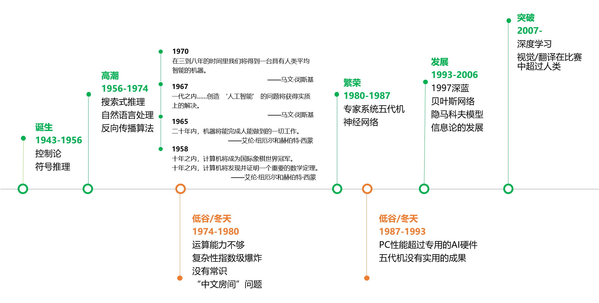

# 人工智能

著名的图灵测试：如果一台机器能够与人类展开对话而不能被辨别出其机器身份，那么称这台机器具有智能。

## 中文房间问题

一个对中文一窍不通，只说英语的人关在一间只有一个开口的封闭房间中。房间里有一本用英文写成的手册，指示该如何处理收到的汉语讯息及如何以汉语相应地回复。房外的人不断向房间内递进用中文写成的问题。房内的人便按照手册的说明，查找合适的指示，将相应的中文字符组合成对问题的解答，并将答案递出房间。

把房间内的人等同于电脑的`CPU`，房间内的说明书相当于程序，房间外的人等同于用户。那么，我们看到用户和电脑在用中文交流，就像用户和中文聊天机器人程序交互一样。这个电脑真的懂中文么？它有智能么？

## 人工智能发展简史

从`1956`年的达特茅斯会议开始，人工智能作为一个专门的研究领域出现，经历了超过半个世纪的起伏，终于在`2007`年前后，迎来了又一次大发展。

人工智能的发展，有这样起伏的模式：

1. 研究（包括技术）取得进展。
2. 研究的进展让人们看到人工智能的潜力，产生非常乐观的期望，例如在`1958`年到`1970`年间科学家对人工智能各种突破的预计，当然他们的绝大多数预计都太乐观了。
3. 上述过高的期望让产业界开始热情地开发各种应用。
4. 但应用未能全部满足期望，于是人工智能行业进入低谷，直到下一波研究和技术取得突破性进展。在`2007`年之后，是大规模的数据和廉价的计算能力，让神经网络技术再度兴起，成为`AI`领域的明星技术。