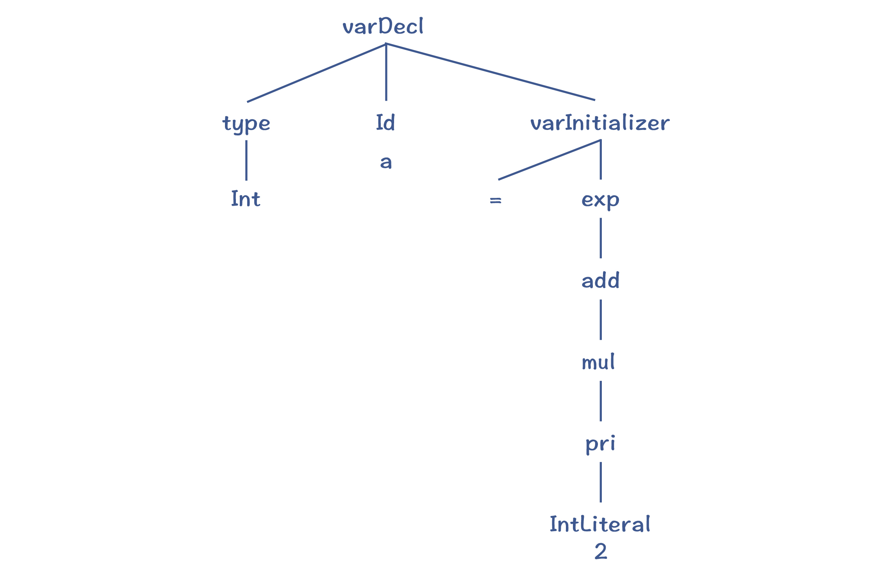
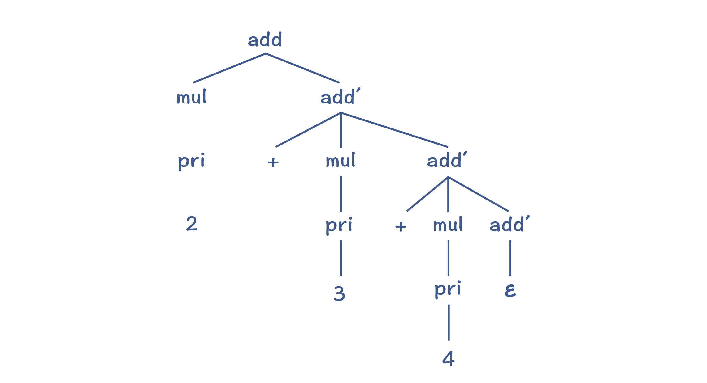
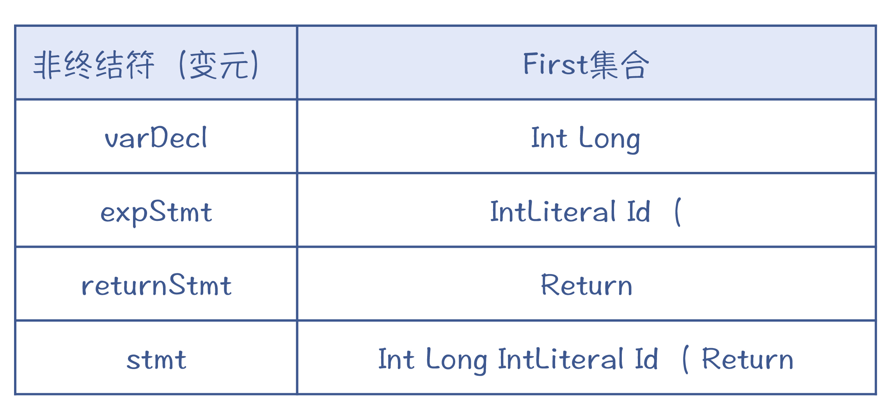
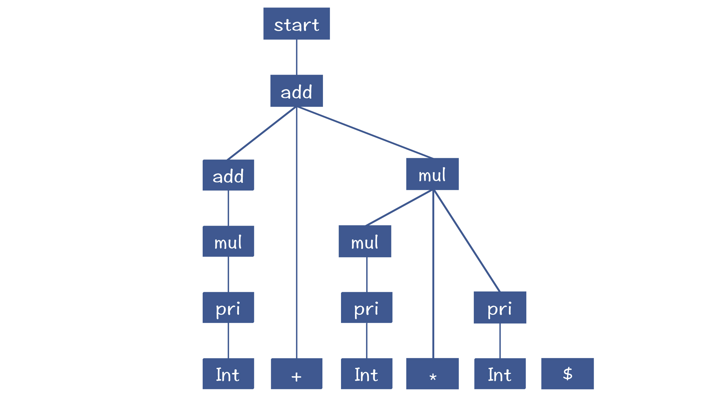
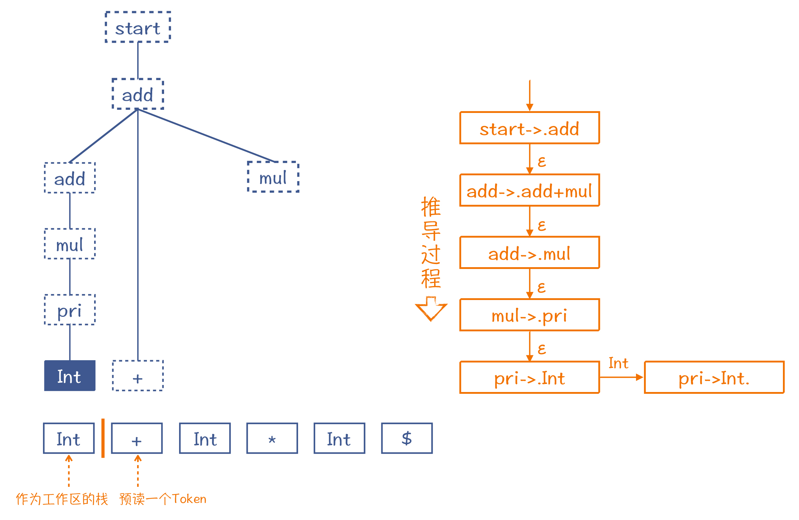
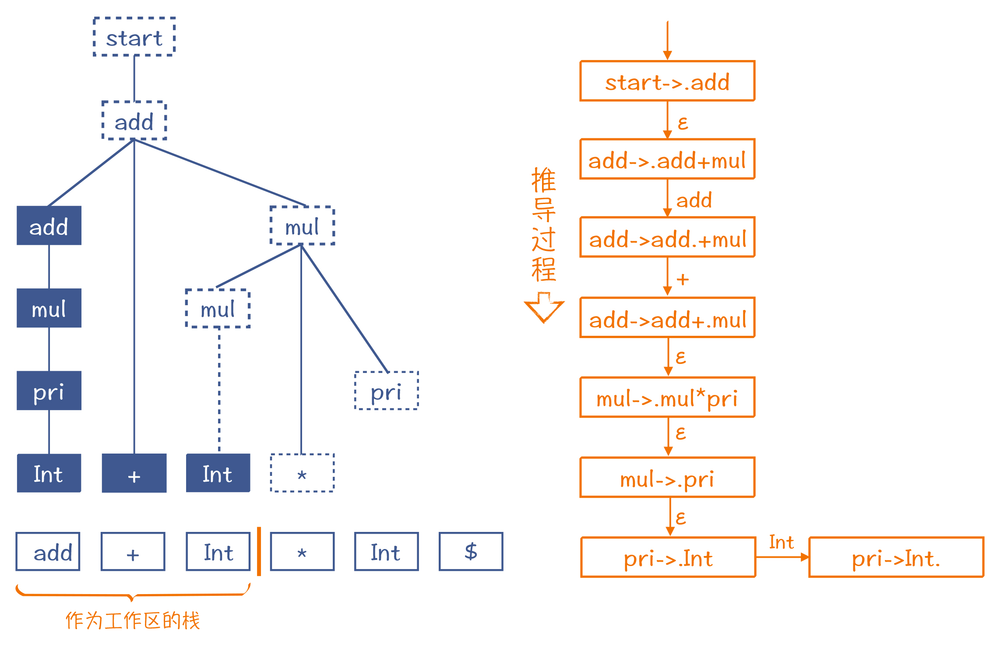
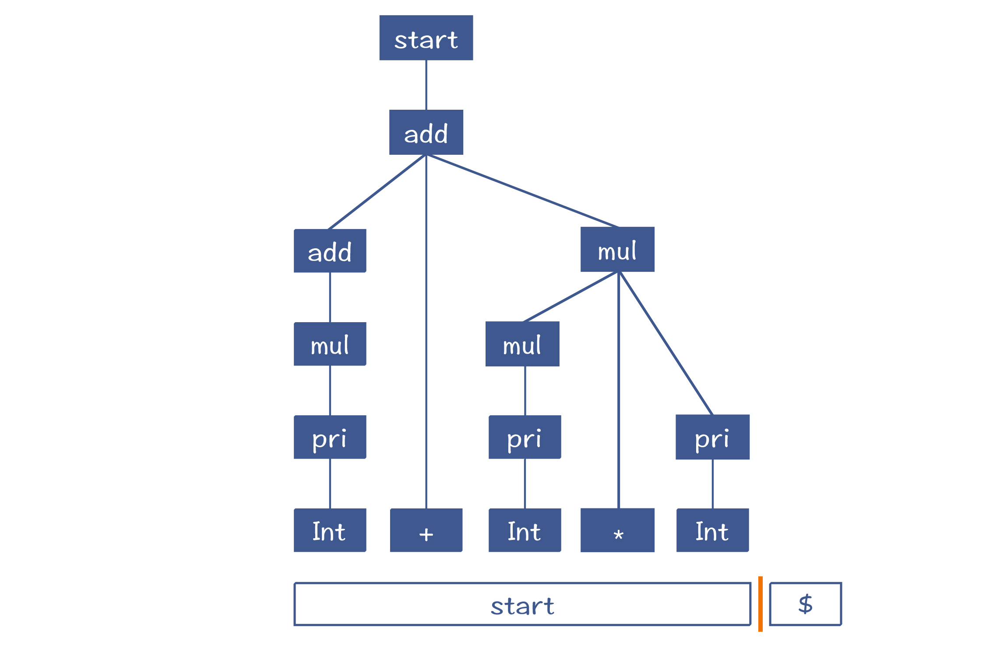

# 语法分析

语法分析的任务，就是将词法分析出的`Token`串，转换成**抽象语法树**。

## 上下文无关文法

在词法分析中，我们使用正规文法来表达词法规则；在语法分析中，需要使用**上下文无关文法**来表达语法规则。

```text
ADD -> ADD + MUL | MUL
MUL -> MUL * pri | pri
```

在语法规则里，箭头`->`左边的叫做非终结符。非终结符可以按照右边的正则表达式来逐步展开，直到最后都变成标识符、字面量、运算符这
些不可再展开的符号，也就是终结符。终结符其实也是词法分析过程中形成的`Token`。

接下来，我们就要依据语法规则，编写语法分析程序，把`Token`串转化成`AST`。

```c
int a = 2;
int b = a + 3;
return b;
```

## 递归下降算法

递归下降算法的基本思路就是按照语法规则去匹配`Token`串。

变量声明的语法规则如下：

```text
varDecl -> types Id varInitializer ';'
varInitializer -> '=' exp | ε
exp -> add
add -> add + mul | mul
mul -> mul * pri | pri
pri -> IntLiteral | Id | ( exp )
```

基于该规则解析的算法如下：

```text
匹配一个数据类型(types)
匹配一个标识符(Id)，作为变量名称
匹配初始化部分(varInitializer)，而这会导致下降一层，使用一个新的语法规则：
    匹配一个等号
    匹配一个表达式(在这个步骤会导致多层下降：exp->add->mul->pri->IntLiteral)
    创建一个varInitializer对应的AST节点并返回
如果没有成功地匹配初始化部分，则回溯，匹配e，也就是没有初始化部分。
匹配一个分号
创建一个varDecl对应的AST节点并返回
```

用上述算法解析`int a = 2`，就会生成下面的`AST`：



- 对于一个非终结符，要从左到右依次匹配其产生式中的每个项，包括非终结符和终结符。
- 在匹配产生式右边的非终结符时，要下降一层，继续匹配该非终结符的产生式。
- 如果一个语法规则有多个可选的产生式，那么只要有一个产生式匹配成功就行。如果一个产生式匹配不成功，那就回退回来，尝试另一个产生式。这种回退过程，叫做回溯`Backtracking`。

### 缺点一：左递归（Left Recursion）

针对文法`add -> add + mul`，产生的解析代码可能会像这样：

```javascript
function analysisAdd() {
    analysisAdd();
    match('+');
    analysisMul();
}
```

然后这个解析器在尝试去解析左递归文法时，会陷入一个无穷的递归。

**引入add'，转换为右递归**

业界常用引入`add'`的方式，将左递归文法转换为右递归文法：

```text
add -> mul add'
add' -> + mul add' | ε
```

生成的`AST`如下：



针对右递归，生成的语法数会先计算`3+4`，这会导致加法的结合性问题。

**用循环改写递归**

在代码实现中，可以用循环代替递归，这样可以在循环里根据运算符结合性要求，手动生成正确的`AST`。

```text
add -> mul ( '+' mul ) * ;
```


### 缺点二：回溯（Backtracking）

递归下降算法是不断尝试根据产生式生成语法树，再去匹配`Token`的。当匹配失败时，必须要“回溯”，这就可能导致浪费。

可以预读后续的一个`Token`，判断此应该选择哪个产生式。

经过仔细观察，你发现如果预读的`Token`是`Int`或`Long`，就选择变量声明语句；如果是`IntLiteral`、`Id`或左括号，就选择表达式语句；而如果是`Return`，则肯定是选择`return`语句。

需要使用`LL`算法，计算`Token`与产生式选择的关系。

## LL 算法：计算 First 和 Follow 集合

**First 集合是每个产生式开头可能会出现的 Token 的集合。**



**对于某个非终结符后面可能跟着的 Token 的集合，我们叫做 Follow 集合。**

如果预读到的`Token`在`Follow`中，那么我们就可以判断当前正在匹配的这个非终结符，产生了`ε`。

这样在计算了`First`和`Follow`集合之后，你就可以通过预读一个`Token`，来完全确定采用哪个产生式。这种算法叫做**LL(1) 算法**。

## LR 算法：移进和规约

自顶向下算法，是从根节点逐层往下分解，形成最后的`AST`；而`LR`算法的原理，则是从底下先拼凑出`AST`的一些局部拼图，并逐步组装成一棵完整的`AST`。

```text
start -> add
add -> add + mul | mul
mul -> mul * pri | pri
pri -> Int | ( add )
```

如果解析`2 + 3 * 5`，最终会形成下面的`AST`：



在下图中，竖线的左边是栈，右边是预读到的一个`Token`。在做语法解析的过程中，竖线会不断地往右移动，`Token`入栈，这个过程叫做**移进**。



根据栈中的`Token`数据，通过产生式按推导过程将终结符反推回去，这个还原过程叫**规约**。



最后，整个`AST`构造完毕，而工作区里也就只剩了一个`Start`节点。



相对于`LL`算法，`LR`算法的优点是能够处理左递归文法。但缺点是不利于输出全面的编译错误信息。因为在没有解析完毕之前，算法并不知道最后的`AST`是什么样子，所以也不清楚当前的语法错误在整体`AST`中的位置。