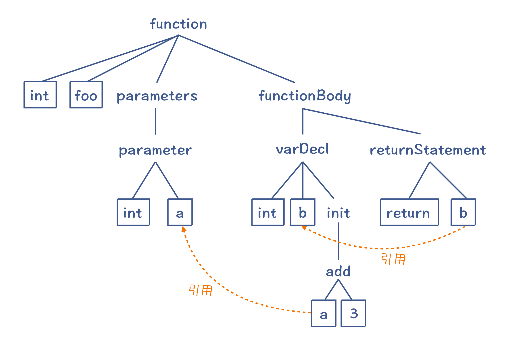
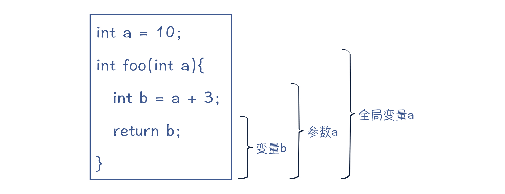
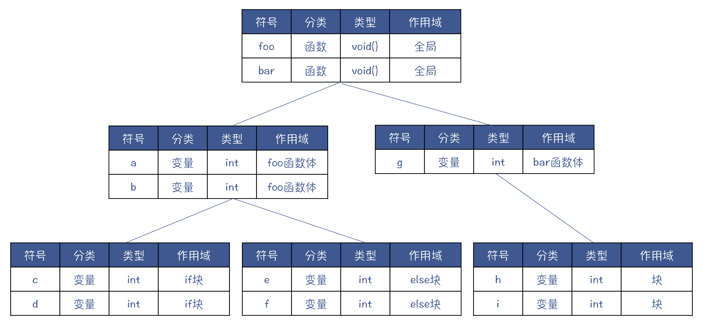
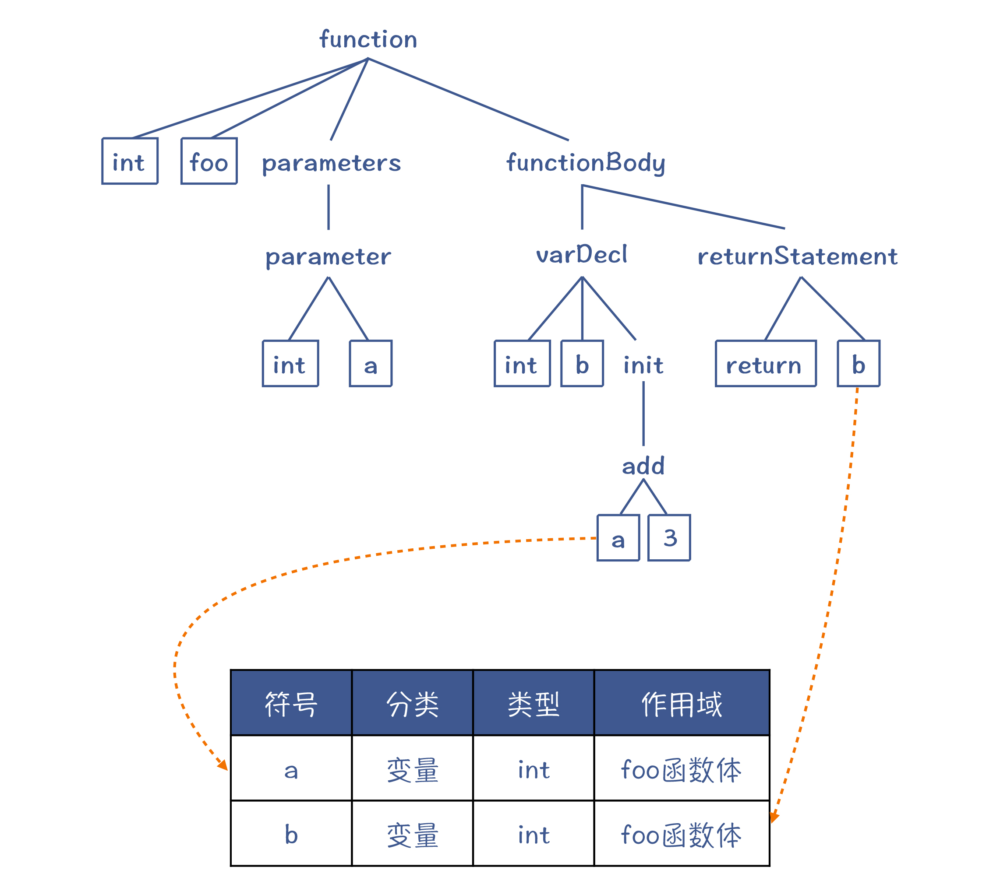
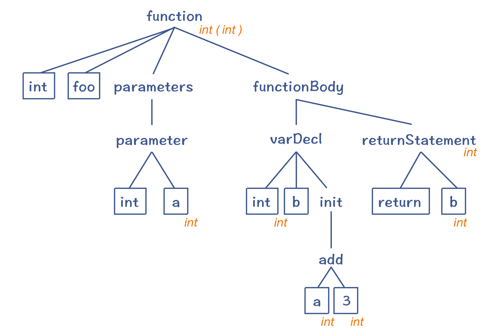

# 语义分析

语义规则可以分为两大类：

第一类规则与上下文有关。语法分析只能处理与上下文无关的工作，而与上下文有关的工作，放到了语义分析阶段。

第二类规则与类型有关。在计算机语言中，类型是语义的重要载体，语义分析阶段要处理与类型有关的工作。比如，声明新类型、类型检查、类型推断等。

某些与类型有关的处理工作，还必须到运行期才能去做。比如，在多态的情况，调用一个方法时，到底要采用哪个子类的实现，只有在运行时才会知道。这叫做动态绑定。

在语义分析过程中，会使用两种数据结构。一个还是`AST`，但我们会把语义分析时获得的一些信息标注在`AST`上，形成带有标注的`AST`。另一个是符号表，用来记录程序中声明的各种标识符，并用于后续各个编译阶段。

## 上下文相关的分析

**场景 1：控制流检查**

像`return`、`break`和`continue`等语句，都与程序的控制流有关，它们必须符合控制流方面的规则。

在`Java`这样的语言中，语义规则会规定：如果返回值不是`void`，那么在退出函数体之前，一定要执行一个`return`语句，那么就要检查所有的控制流分支，是否都以`return`语句结尾。

**场景 2：闭包分析**

很多语言都支持闭包。而要正确地使用闭包，就必须在编译期知道哪些变量是自由变量。这里的自由变量是指在本函数外面定义的变量，但被这个函数中的代码所使用。这样，在运行期，编译器就会用特殊的内存管理机制来管理这些变量。所以，对闭包的分析，也是上下文敏感的。

**场景 3：引用消解**

在高级语言里，我们会做变量、函数（或方法）和类型的声明，然后在其他地方使用它们。这个时候，我们要找到定义和使用之间的正确引用关系。

在语法分析阶段，对于`int b = a + 3`这样一条语句，无论`a`是否提前声明过，在语法上都是正确的。而在实际的计算机语言中，如果引用某个变量，这个变量就必须是已经声明过的。同时，当前这行代码，要处于变量`a`的作用域中才行。



对于变量来说，为了找到正确的引用，就需要用到**作用域**。

作用域的第一个使用场景，指的是变量、函数等标识符可以起作用的范围。下图列出了三个变量的作用域，每个变量声明完毕以后，它的下一句就可以引用它。



作用域的第二个使用场景，是词法作用域，也就是程序中的不同文本区域。比如，一个语句块、参数列表、类定义的主体、函数（方法）的主体、模块主体、整个程序等。

标识符和词法的作用域的差异在于：一个本地变量（标识符）的作用域，虽然属于某个词法作用域（如某个函数体），但其作用范围只是在变量声明之后的语句。而类的成员变量（标识符）的作用域，跟词法作用域是一致的，也就是整个类的范围，跟声明的位置无关。如果这个成员变量不是私有的，它的作用域还会覆盖到子类。

在做引用消解的时候，为了更好地查找变量、类型等定义信息，编译器会使用一个辅助的数据结构：**符号表**。

## 符号表

在写程序的时候，我们会定义很多标识符，比如常量名称、变量名称、函数名称、类名称，等等。在编译器里，我们又把这些标识符叫做符号`Symbol`。用来保存这些符号的数据结构，就叫做符号表。

```c
void foo() {
    int a;
    int b;
    if (a > 0) {
        int c;
        int d;
    } else {
        int e;
        int f;
    }
}

void bar() {
    int g;
    {
        int h;
        int i;
    }
}
```

针对上述代码，它的符号表可能是下面这样的，分成了多个层次，每个层次对应了一个作用域。



针对引用消解，其实就是从符号表里查找被引用的符号的定义：



符号表除了用于引用消解外，还可以辅助完成语义分析的其他工作。比如，在做类型检查的时候，我们可以从符号表里查找某个符号的类型，从而检查类型是否兼容。

## 类型分析和处理

关于类型检查，编译器一般会采用**属性计算**的方法，来计算出每个`AST`节点的类型属性，然后检查它们是否匹配。

以`int b = a + 3`为例，它的`AST`如下图所示：


有些属性是通过子节点计算出来的，这叫做**S 属性**`Synthesized Attribute`(综合出来的属性)，比如等号右边的类型。而另一些属性，则要根据父节点或者兄弟节点计算而来，这种属性叫做**I 属性**`Inherited Attribute`(继承到的属性)，比如等号左边的`b`变量的类型。

计算出来的属性，标注在`AST`上。

