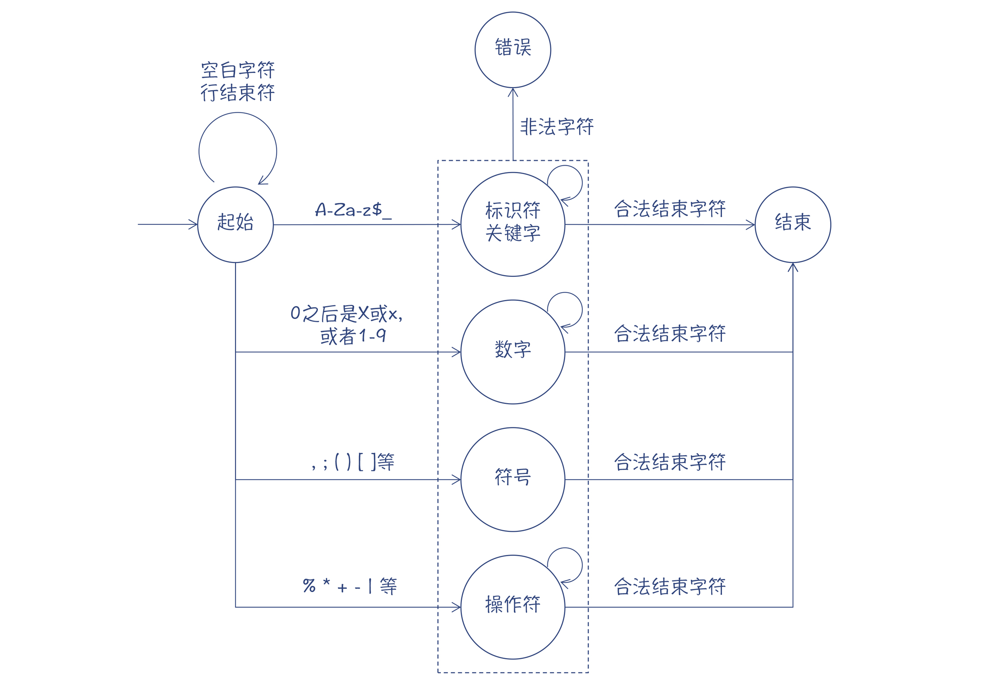

# 走近 Java 编译器

## Java 编译器概述

`javac`命令可以将`Java`代码编译成字节码文件，但`javac`并不是`Java`编译器。

`javac`只是启动了一个`Java`虚拟机，执行了一个`Java`程序，跟我们平常用`java`命令运行一个程序是一样的。换句话说，`Java`编译器本身也是用`Java`写的。

一门语言的编译器，竟然可以用自己来实现。这种现象，叫做**自举**`Bootstrapping`。实际上，一门语言的编译器，一开始肯定是要用其他语言来实现的。但等它成熟了以后，就会尝试实现自举。

既然`Java`编译器是用`Java`实现的，那意味着你自己也可以写一个程序，来调用`Java`的编译器。

```java
import javax.tools.JavaCompiler;
import javax.tools.ToolProvider;

public class CoreApplication {

    public static void main(String[] args) {
        JavaCompiler compiler = ToolProvider.getSystemJavaCompiler();
        int result = compiler.run(null, null, null, "CoreTest.java");
        System.out.println("result is " + result);
    }
}
```

`java.compiler`模块是`Java`编译器的`API`，`jdk.compiler`模块是`Java`编译器的具体实现。

## 词法分析器

`Java`的词法分析器的具体实现在`JavaTokenizer`中，其`readToken`方法实现了主干的词法分析逻辑，能够从字符流中识别出`Token`。

`readToken`逻辑如下：

```text
循环读取字符:
    case 空白字符:
        处理 继续循环
    case 行结束符:
        处理 继续循环
    case A-Za-z$_:
        调用scanIden识别标识符和关键字 并结束循环
    case 0开头的2/8/16进制 或10进制1-9 以及小数点:
        调用scanNumber识别数字 并结束循环
    case , ; ( ) [ ] { } 等符号:
        返回代表这些符号的 Token 并结束循环
    case isSpecial 识别特殊字符:
        调用scanOperator识别操作符
```



针对关键字与标识符冲突的问题：`Java`首先把所有的关键字和标识符都作为标识符识别出来，然后再从里面把所有预定义的关键字挑出来。这比构造一个复杂的有限自动机实现起来更简单！

## 语法分析器