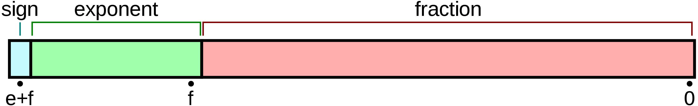
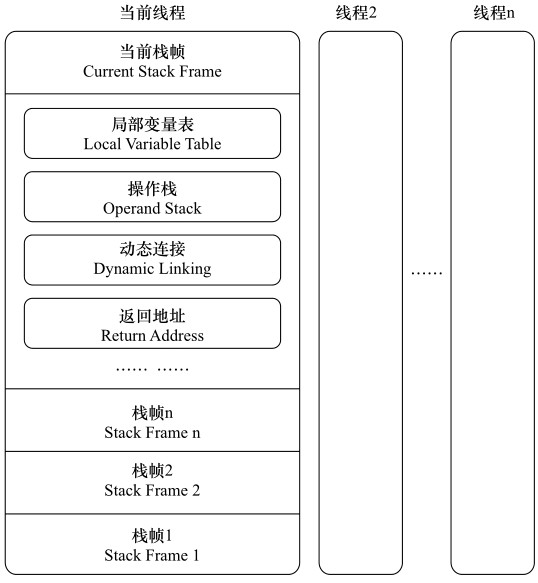

# Java 的基本类型

## 基本类型

| 类型 | 值域 | 默认值 |
|:----:|:----:|:----:|
| boolean | {false, true} | false |
| char | [0, 65535] | '\u0000' |
| byte | [-128, 127] | 0 |
| short | [-32768, 32767] | 0 |
| int | [-2^31, 2^31 - 1] | 0 |
| long | [-2^63, 2^63 - 1] | 0l |
| float | [-3.4E38, 3.4E38] | +0.0f |
| double | [-1.8E308, 1.8E308] | +0.0d |

*注：在科学记数法中，字母`E`是用于表示`10`次方。`1.314E+1` = `1.314 * 10^1`。*

`byte`、`short`、`int`、`long`、`float`以及`double`的值域依次扩大，而且前面的值域被后面的值域所包含，从前面的基本类型转换至后面的基本类型，无需强制转换。

虽然各类型的默认值看起来不一样，但在内存中都是`0`。

`boolean`和`char`是唯二的无符号类型。

`Java`的浮点类型采用`IEEE 754`浮点数格式：**`value = (-1)^sign * fraction * 2^exponent`**。

| 类型 | 符号位 | 指数位(e) | 尾数位(m) |
|:----:|:----:|:----:|:----:|
| float | 1 | 8 | 23 |
| double | 1 | 11 | 52 |

## 基本类型的大小

| 类型 | 存储需求(字节) |
|:----:|:----:|
| byte | 1 |
| short | 2 |
| int | 4 |
| long | 8 |
| boolean | 1 |
| char | 2 |
| float | 4 |
| double | 8 |

todo: Java 虚拟机栈的大小 基本类型直接存在栈里 不在堆里

