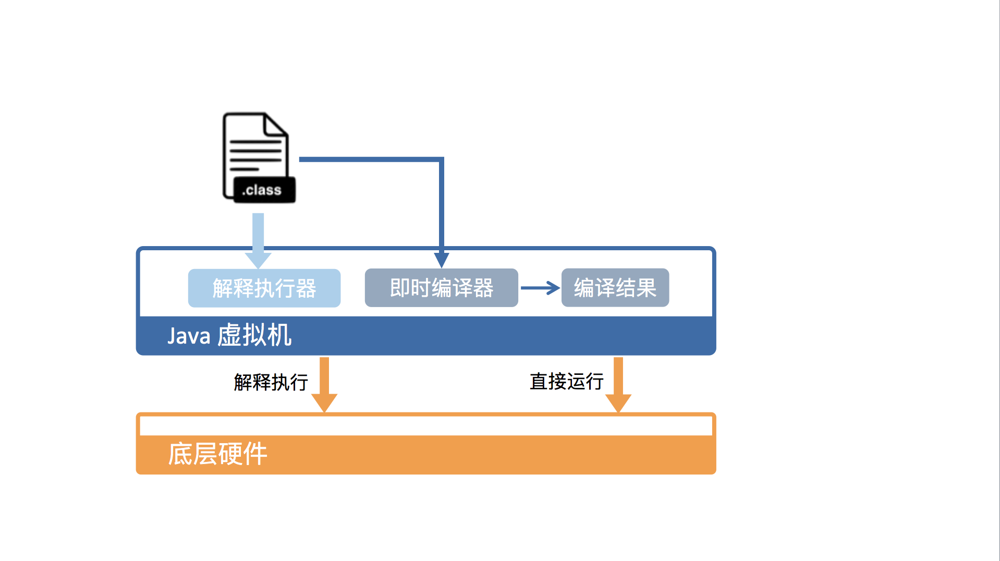

# 深入拆解 Java 虚拟机

`Java`代码的运行离不开`JRE`，也就是`Java`运行时环境。

然而，运行`C++`代码则无需额外的运行环境。我们往往把这些代码直接编译成`CPU`所能理解的代码格式，也就是机器码。

既然`C++`的运行方式如此成熟，为什么`Java`要在虚拟机中运行呢？`Java`虚拟机具体又是怎样运行`Java`代码的呢？它的运行效率又如何呢？

## 为什么 Java 要在虚拟机里运行？

`Java`虚拟机屏蔽了硬件层面的底层实现，对外提供统一的`API`，一个程序被转换成`Java`字节码，那么它可以在不同平台上的虚拟机实现里运行。“一次编写，到处运行”。

虚拟机的另外一个好处是它带来了一个托管环境`Managed Runtime`。这个托管环境能够代替我们处理一些代码中冗长而且容易出错的部分。其中最广为人知的当属自动内存管理与垃圾回收。

除此之外，托管环境还提供了诸如数组越界、动态类型、安全权限等等的动态检测，使我们免于书写这些无关业务逻辑的代码。

## Java 虚拟机是怎样运行字节码的？

从虚拟机视角来看，执行`Java`代码首先需要将它编译而成的`class`文件加载到`Java`虚拟机中。加载后的`Java`类会被存放于方法区`Method Area`中。实际运行时，虚拟机会执行方法区内的代码。

`Java`虚拟机将栈细分为面向`Java`方法的`Java`方法栈，面向本地方法（用`C++`写的`native`方法）的本地方法栈，以及存放各个线程执行位置的`PC`寄存器。

在运行过程中，每当调用进入一个`Java`方法，`Java`虚拟机会在当前线程的`Java`方法栈中生成一个栈帧，用以存放局部变量以及字节码的操作数。当退出当前执行的方法时，不管是正常返回还是异常返回，`Java`虚拟机均会弹出当前线程的当前栈帧，并将之舍弃。

从硬件视角来看，`Java`字节码无法直接执行。`Java`虚拟机需要将字节码翻译成机器码。

在`HotSpot`里面，上述翻译过程有两种形式：第一种是解释执行，即逐条将字节码翻译成机器码并执行；第二种是即时编译`Just-In-Time compilation JIT`，即将一个方法中包含的所有字节码编译成机器码后再执行。

前者的优势在于无需等待编译，而后者的优势在于实际运行速度更快。`HotSpot`默认采用混合模式，综合了解释执行和即时编译两者的优点。它会先解释执行字节码，而后将其中反复执行的热点代码，以方法为单位进行即时编译。

## Java 虚拟机的运行效率究竟是怎么样的？

即时编译建立在程序符合二八定律的假设上，`20%`的代码占据了`80%`的计算资源。

对于占据大部分的不常用的代码，我们无需耗费时间将其编译成机器码，而是采取解释执行的方式运行；另一方面，对于仅占据小部分的热点代码，我们则可以将其编译成机器码，以达到理想的运行速度。

理论上讲，即时编译后的`Java`程序的执行效率，是可能超过`C++`程序的。这是因为与静态编译相比，即时编译拥有程序的运行时信息，并且能够根据这个信息做出相应的优化。

`HotSpot`内置了多个即时编译器：`C1`、`C2`和`Graal`。`Graal`是`Java 10`正式引入的实验性即时编译器。

`C1`又叫做`Client`编译器，面向的是对启动性能有要求的客户端`GUI`程序，采用的优化手段相对简单，因此编译时间较短。

`C2`又叫做`Server`编译器，面向的是对峰值性能有要求的服务器端程序，采用的优化手段相对复杂，因此编译时间较长，但同时生成代码的执行效率较高。

从`Java 7`开始，`HotSpot`默认采用分层编译的方式：热点方法首先会被`C1`编译，而后热点方法中的热点会进一步被`C2`编译。`HotSpot`的即时编译是放在额外的编译线程中进行的。

在计算资源充足的情况下，字节码的解释执行和即时编译可同时进行。编译完成后的机器码会在下次调用该方法时启用，以替换原本的解释执行。