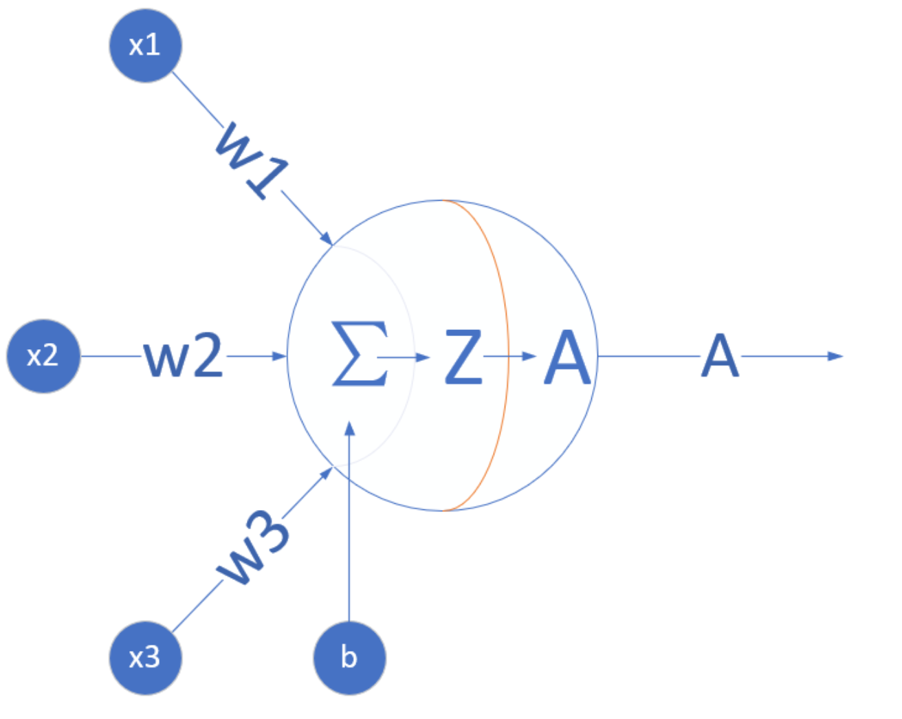

# 人工智能的定义

人们口中的人工智能其实是一个非常庞杂的概念，从人们对人工智能的期待，技术，和应用角度，都有很多不同的概念。

## 期待

- **智能地把某件特定的事情做好，在某个领域增强人类的智慧，这种方式又叫做智能增强。**

像搜索引擎，自动语言翻译，某个领域的智能助手那样的程序，帮助人类完成某种特定任务。这也叫做“弱人工智能”，或者“狭义人工智能”。

- **像人类一样能认知，思考，判断：模拟人类的智能。**

像人类一样能认知，思考，判断的智能软件。这是人工智能学科一开始就有的梦想。这样的智能也叫做“通用人工智能”，或“强人工智能”。对于这样的人工智能，科幻小说有很多描写，也有一些研究，但是在实际的应用还没有什么突破。

## 技术

要实现某种狭义的人工智能，希望能让运行程序的电脑来学习并自动掌握某些规律，这就是“机器学习”。机器学习在几十年的发展历史中，产生了很多技术，这些技术都有下面的共性：

> 如果一个程序解决任务`T`的效能`P`随着经验`E`得到了提高，那么，这个程序就能从经验`E`中学到了关于任务`T`的知识，并让衡量值`P`得到提高。

1. 选择一个模型结构（例如逻辑回归，决策树等），这就是上面说的程序。
2. 用训练数据（输入和输出）输入模型。这就是上面的经验`E`。
3. 通过不断执行任务`T`并衡量结果`P`，让`P`不断提高，直到达到一个满意的值。

**机器学习的各种方法是如何从经验中学习呢？**

1. 监督学习：通过标注的数据来学习。程序通过学习标注了正确答案的手写数字的图像数据，它就能认识其他的手写数字。
2. 无监督学习：通过没有标注的数据来学习。可以发现数据中自然形成的共性，用来发现不同数据之间的联系，买了商品`A`的顾客往往也购买了商品`B`。
3. 强化学习：让程序选择和它的环境互动。玩一个游戏，环境给程序的反馈是一些“奖励”，程序要学习到一个模型，能在这种环境中得到高的分数。

综合来看，如果我们把机器学习当作一个小孩，那么，教育小孩的方式就有根据正确答案指导学习（监督学习）；根据小孩实践的过程给予各种鼓励（强化学习）；还有自由探索世界，让小孩自己总结规律（无监督学习）。

机器学习领域出现了各种模型，神经网络模型是一个重要的方法。在生物神经网络中，每个神经元与其他神经元相连，当它兴奋时，就会像相邻的神经元发送化学物质，从而改变这些神经元内的电位；如果某神经元的电位超过了一个阈值，那么它就会被激活（兴奋），向其他神经元发送化学物质。把许多这样的神经元按照一定的层次结构连接起来，我们就构建了一个神经网络。

随着数据的丰富和机器算力的增强，人们不断增加神经网络的层次数目，相邻层次之间的输入输出由非线性函数来控制，这就产生了`DNN`（深度神经网络）。`DNN`在最近十年给人工智能领域带来了新的生机，并在图像分类、语音识别、自然语言处理等方面取得了重大突破。

随着人们不断的调整网络结构，`DNN`也演变成许多不同的网络拓扑结构，例如`CNN`（卷积神经网络），`RNN`（循环神经网络），`LSTM`（长期短期记忆），`GAN`（生成对抗网络），`Transfer Learning`（迁移学习）等，这些模型还在不断演化中。

## 应用

从应用的角度来看，狭义人工智能在各个领域都取得了很大的成果。