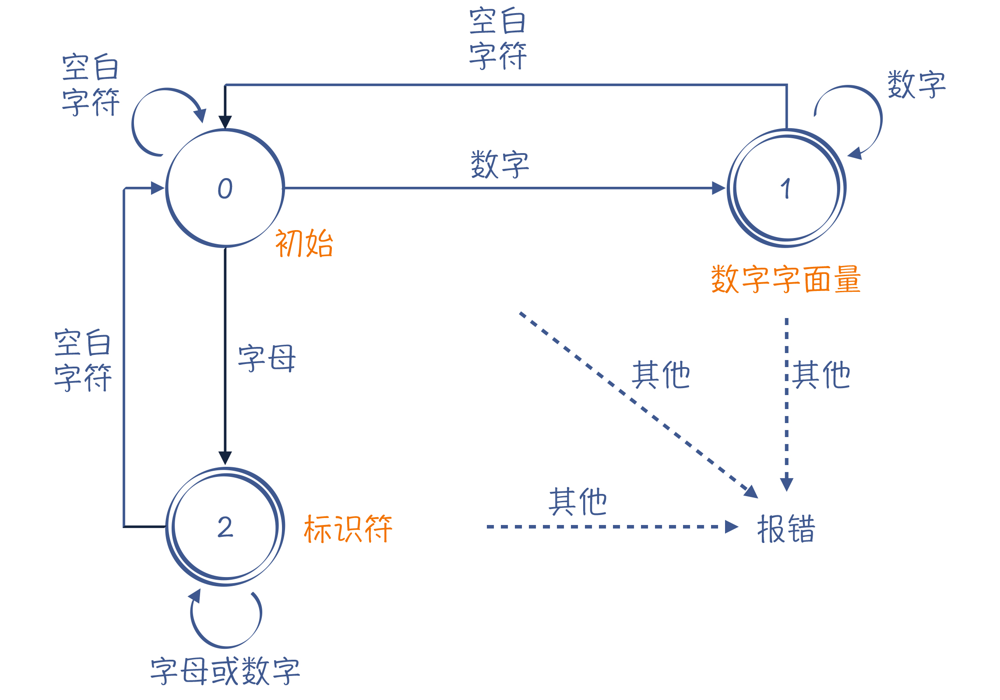
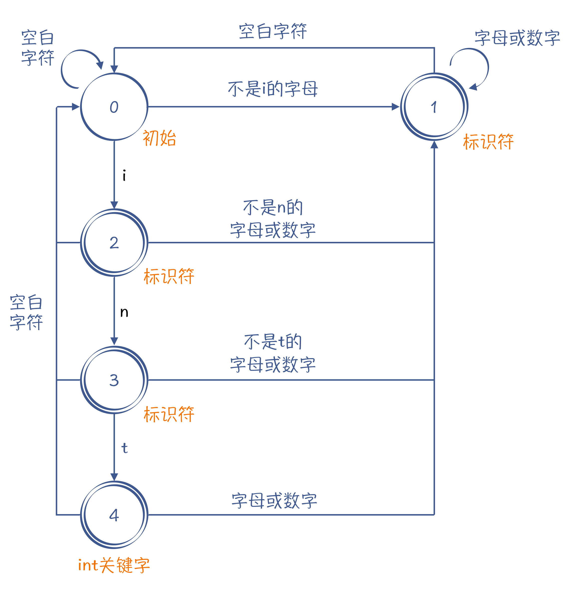
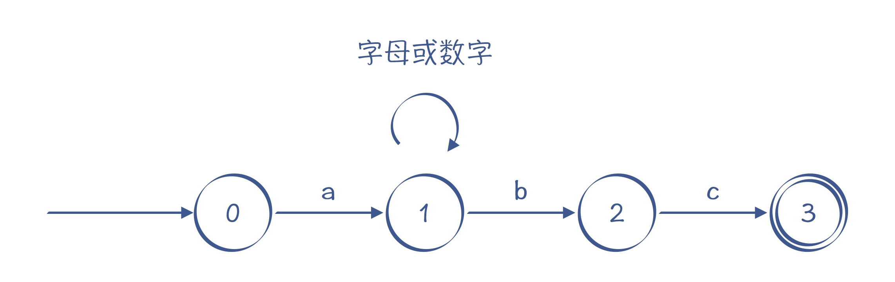

# 词法分析

词法分析的任务是：输入的是字符串，输出的是`Token`串。所以，词法分析器在英文中一般叫做`Tokenizer`。


## 词法分析的原理

业界常引入**有限自动机理论**，实现词法分析程序。



单线圆圈表示初始节点，双线圆圈表示终态节点。终态节点就是一个合格的`Token`，当终态节点遇到空白字符的时候，就可以记下一个`Token`，并回到初始态，开始识别其他`Token`。

> 词法分析的过程，其实就是对一个字符串进行模式匹配的过程。

相较于学术中的词法分析，在实际开发中碰到需要字符串模式匹配时，我们更熟悉正则表达式。如`[0-9]+abc`，匹配以数字开头，以字母`abc`结尾的字符串。

使用正则表达式来描述词法规则的描述方法，称为正则文法。

假定存在如下正则文法：

```shell
Int : int;                    // int 关键字
Id  : [A-Za-z][A-Za-z0-9]*;   // 以字母开头，后面可以是字符或数字
```

因`int`关键字和正常的`id`标识符存在重叠，所以，词法规则里面要有优先级。最终设计出的有限自动机如下图：



手动设计有限自动机太复杂了，有没有一种方法，可以只写出词法规则，就自动生成相对应的有限自动机呢？

## 从正则表达式生成有限自动机

为了能自动生成有限自动机：业界常把一个正则表达式翻译成`NFA`，然后把`NFA`转换成`DFA`。

`DFA`，确定的有限自动机。该状态机在任何一个状态，基于输入的字符，都能做一个确定的状态转换。

`NFA`，不确定的有限自动机。该状态机中存在某些状态，针对某些输入，不能做一个确定的转换。

针对正则表达式`a[a-zA-Z0-9]*bc`，可以构建如下自动机：



状态`1`的节点输入`b`时，这个状态是有两条路径可以选择的：一条是迁移到状态`2`，另一条是仍然保持在状态`1`。所以，这个有限自动机是一个`NFA`。

基于`NFA`，你仍然可以实现一个词法分析器：当某个状态存在一条以上转换路径时，需要先尝试其中的一条；如果匹配不上，再退回来，尝试其他路径；这个过程叫做**回溯（Backtracking）**。

因为存在多条可能的路径，所以需要试探和回溯，在比较极端的情况下，回溯次数会非常多，性能会变得非常差。通常使用**子集构造法**将`NFA`转换成`DFA`，再实现词法分析器。