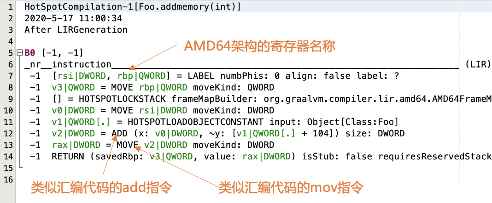
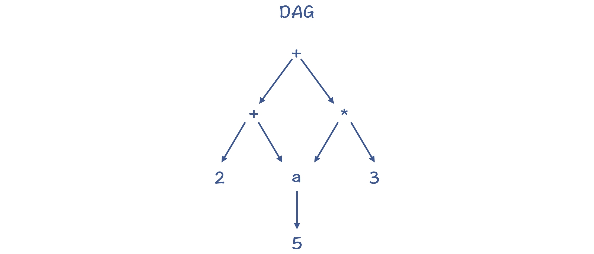

# 中间代码

`IR`，也就是中间代码`Intermediate Representation`，有时也称`Intermediate Code`，它是编译器中很重要的一种数据结构。编译器在做完前端工作以后，首先就是生成`IR`，并在此基础上执行各种优化算法，最后再生成目标代码。

## IR 的用途和层次

设计`IR`的用途：

- 分析和变换
- 直接解释执行

编译器中，基于`IR`的分析和处理工作，一开始可以基于一些抽象层次比较高的语义，这时所需要的`IR`更接近源代码。而在后面，则会使用低层次的、更加接近目标代码的语义。

基于这种从高到低的抽象层次，`IR`可以归结为`HIR`、`MIR`和`LIR`三类。

### HIR：基于源语言做一些分析和变换

`High IR`，能够准确表达源语言的语义。

`AST`和符号表也可以准确表达源语言的语义，`AST`也可以算作一种`IR`。

基于`HIR`，可以做一些高层次的代码优化，比如常数折叠、内联等。在`Java`和`Go`的编译器中，你可以看到不少基于`AST`做的优化工作。

### MIR：独立于源语言和 CPU 架构做分析和优化

大量的优化算法是可以通用的，没有必要依赖源语言的语法和语义，也没有必要依赖具体的`CPU`架构。

这些优化包括部分算术优化、常量和变量传播、死代码删除等。实现这类分析和优化功能的`IR`称为`Middle IR`。

因为`MIR`跟源代码和目标代码都无关，所以在讲解优化算法时，通常是基于`MIR`，如三地址代码`Three Address Code，TAC`。

```c
int foo(int a) {
    int b = 0;
    if (a > 10)
        b = a;
    else
        b = 10;
    return b;
}
```

以上代码对应的`TAC`是：

```text
BB1:
    b := 0
    if a > 10 goto BB3
BB2:
    b := 10
    goto BB4
BB3:
    b := a
BB4:
    return b
```

`TAC`用`goto`语句取代了`if`语句、循环语句这种比较高级的语句，当然也不会有类、继承这些高层的语言结构。但是，它又没有涉及数据如何在内存读写等细节，书写格式也不像汇编代码，与具体的目标代码也是独立的。

### LIR：依赖于 CPU 架构做优化和代码生成

`Low IR`，其指令通常可以与机器指令一一对应，比较容易翻译成机器指令或汇编代码。`LIR`体现了`CPU`架构的底层特征，因此可以做一些`CPU`架构相关的优化。



这是`Java`的`JIT`编译器输出的`LIR`信息，里面的指令名称已经跟汇编代码很像了，并且会直接使用`AMD64`架构的寄存器名称。

### P-code：用于解释执行的 IR

`Portable Code`，与具体机器无关，因此可以很容易地运行在多种电脑上。这类`IR`对编译器来说，就是做编译的目标代码。`Java`的字节码就是`P-code`。除此之外，`Python`、`Erlang`也有自己的字节码，`.NET`平台、`Visual Basic`程序也不例外。

其实，完全可以基于`AST`实现一个全功能的解释器，只不过性能会差一些。对于专门用来解释执行的`IR`，通常会有一些特别的设计，跟虚拟机配合来尽量提升运行速度。

`P-code`也可能被进一步编译，形成可以直接执行的机器码。`Java`的字节码就是这样的例子。

## IR 的数据结构

`IR`并不像源代码和汇编代码那样有特定的书写格式，只是编译过程中的一个数据结构而已。

在实际的实现中，有线性结构、树结构、有向无环图`DAG`、程序依赖图`PDG`等多种格式。要根据具体要处理的工作的特点，来选择合适的数据结构。

### 第一种：类似 TAC 的线性结构（Linear Form）

你可以把代码表示成一行行的指令或语句，用数组或者列表保存就行了。其中的符号，需要引用符号表，来提供类型等信息。

这种线性结构有时候也被称作`goto`格式。因为高级语言里的条件语句、循环语句，要变成用`goto`语句跳转的方式。

### 第二种：树结构

树结构可以用作`IR`，`AST`就是一种树结构。树结构的缺点是，可能有冗余的子树。


语句`a = 5; b = (2 + a) + a * 3;`形成的`AST`，如果基于这个树结构生成代码，可能会做两次从内存中读取`a`的值的操作，并存到两个临时变量中。

### 第三种：有向无环图（Directed Acyclic Graph，DAG）

`DAG`结构，是在树结构的基础上，消除了冗余的子树。转化成`DAG`以后，对`a`的内存访问只做一次就行了。



### 第四种：程序依赖图（Program Dependence Graph，PDG）

程序依赖图，是显式地把程序中的数据依赖和控制依赖表示出来，形成一个图状的数据结构。基于这个数据结构，我们再做一些优化算法的时候，会更容易实现。

所以现在，有很多编译器在运行优化算法的时候，都基于类似`PDG`的数据结构，比如我在课程后面会分析的`Java`的`JIT`编译器和`JavaScript`的编译器。

## SSA 格式的 IR

`SSA`是`Static Single Assignment`的缩写，也就是静态单赋值。这是`IR`的一种设计范式，它要求一个变量只能被赋值一次。

`y = x1 + x2 + x3 + x4`的普通`TAC`如下：

```text
y := x1 + x2;
y := y + x3;
y := y + x4;
```

其中，`y`被赋值了三次，改写成`SSA`的形式：

```text
t1 := x1 + x2;
t2 := t1 + x3;
y  := t2 + x4;
```

为什么要费力写成这种形式呢，还要为此多添加`t1`和`t2`两个临时变量？

原因是，使用`SSA`的形式，体现了精确的**使用 - 定义**`Use-def`关系。并且由于变量的值定义出来以后就不再变化，使得基于`SSA`更容易运行一些优化算法。

```c
int foo(int a) {
    int b = 0;
    if (a > 10)
        b = a;
    else
        b = 10;
    return b;
}
```

对于同样的示例代码，对应的`SSA`格式如下：

```text
BB1:
    b1 := 0
    if a > 10 goto BB3
BB2:
    b2 := 10
    goto BB4
BB3:
    b3 := a
BB4:
    b4 := phi(BB2, BB3, b2, b3)
    return b4
```

`phi`指令，会根据控制流的实际情况确定`b4`的值。如果`BB4`的前序节点是`BB2`，那么`b4`的取值是`b2`；而如果`BB4`的前序节点是`BB3`，那么`b4`的取值就是`b3`。

如果要满足`SSA`的要求，那么在遇到有程序分支的情况下，就必须引入`phi`指令。

**由于 SSA 格式的优点，现代语言用于优化的 IR，很多都是基于 SSA 的了，包括我们本课程涉及的 Java 的 JIT 编译器、JavaScript 的 V8 编译器、Go 语言的 gc 编译器、Julia 编译器，以及 LLVM 工具等。**