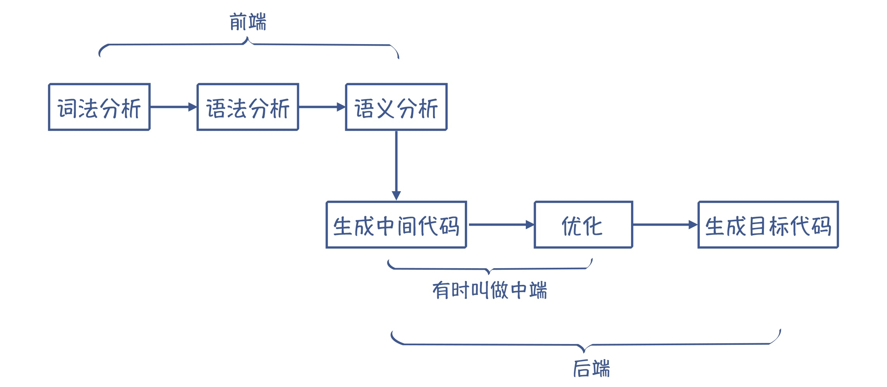
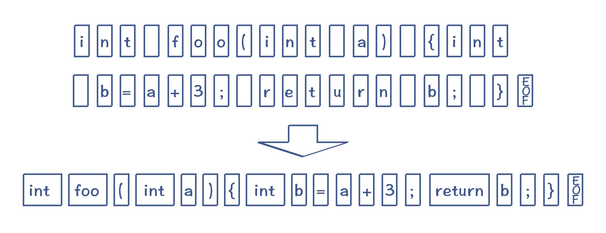
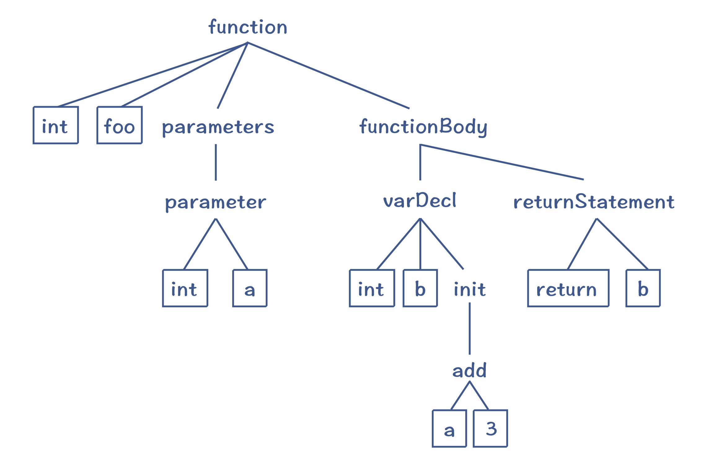
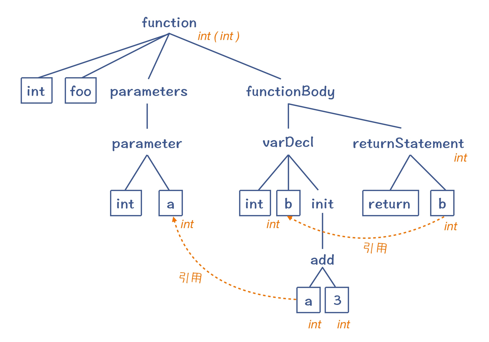
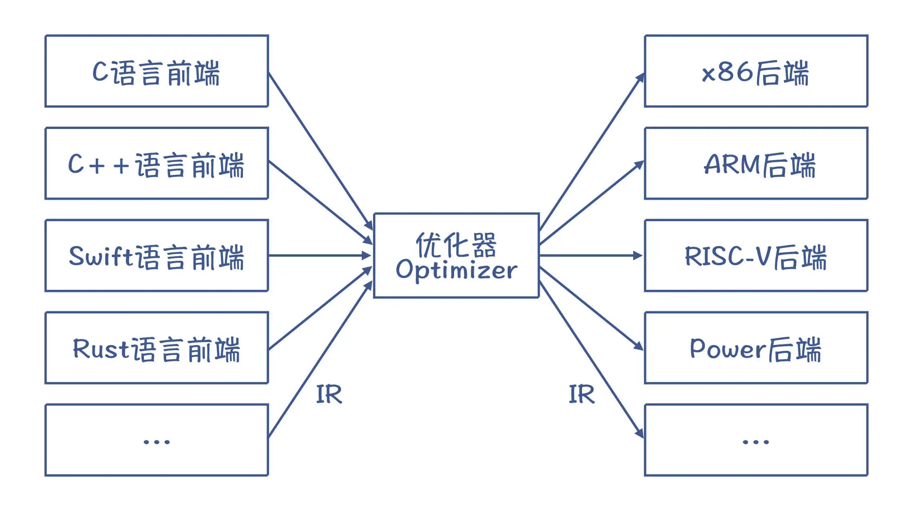

# 编译原理

先看一个例子：

```c
#include <stdio.h>

int main() {
    printf("Hello World!\n");
    return 0;
}
```

```shell
➜  test gcc -o main main.c
➜  test ./main
Hello World!
```

从一段朴素的`printf`，到计算机打印出`Hello World!`，问题来了：计算机，是怎么理解人类的编程语言并正确执行的？

## 何为编译

我们使用`Java`、`C++`等高级语言进行日常开发，而机器运行的是机器语言；**从我们的源代码变成目标语言的过程，称为编译。**

如果源代码编译后要在操作系统运行，目标代码就是汇编代码；如果编译后在解释器中执行，目标代码是一种解释器可以理解的中间代码即可。



## 词法分析（Lexical Analysis）

在编译之前，源代码只是一长串字符而已。所以，编译的第一步，就是要像读文章一样，先把里面的单词和标点符号识别出来。程序里面的单词叫做`Token`，它可以分成关键字、标识符、字面量、操作符号等多个种类。

**把字符串转换为 Token 的过程，就叫做词法分析。**



## 语法分析（Syntactic Analysis）

词法分析程序识别出`Token`后，我们需要让编译器**像理解自然语言一样，理解它的语法结构**，称为**语法分析**。

语法分析程序会把`Token`串，转换成一个**体现语法规则的、树状的数据结构——抽象语法树**。



这样的一棵`AST`反映了示例程序的语法结构。这棵抽象语法树的顶部就是一个函数节点，它包含了四个子节点，刚好反映了函数的语法。

## 语义分析（Semantic Analysis）

**语义分析程序会针对语法树进行上下文相关分析，生成带有语义信息的抽象语法树 Abstract Syntax Tree。**

语义理解：下图中的参与`add`运算的叶子节点`a`，是上文中已赋值的全局变量？还是参数中传入的引用？都需要程序结合上下文进行引用消解。

语义检查：语义分析过程进行变量的类型检查等。



## 中间代码（Intermediate Representation）

中间代码`IR`，是处于源代码和目标代码之间的一种表示形式。

`Python`和`Java`等解释型的语言，可以直接执行`IR`，编译器生成`IR`以后就完成任务了，没有必要生成最终的汇编代码。

另外，我们生成代码的时候，需要做大量的优化工作。如果基于汇编代码来做，那需要根据不同的`CPU`架构进行适配，而基于`IR`，可以用统一的算法来完成。

## 优化（Optimization）

`Java`中通过公有方法实现对私有属性的访问，但在汇编代码中，函数调用会花费很大的开销。通过进行方法的**内联**，将函数内的逻辑直接嵌入函数调用者的代码中，实现性能提升。

并且针对一些不是最优的代码，编译器进行纠正优化以提升性能。



采用中间代码来编写优化算法的好处，可以把大部分的优化算法，写成与具体`CPU`架构无关的形式，从而大大降低编译器适配不同`CPU`的工作量。

## 生成目标代码

生成目标代码，即生成最终的汇编代码。

1. 选择合适的指令，生成性能最高的代码。
2. 优化寄存器的分配，让频繁访问的变量（比如循环变量）放到寄存器里，因为访问寄存器要比访问内存快`100`倍左右。
3. 在不改变运行结果的情况下，对指令做重新排序，从而充分运用`CPU`内部的多个功能部件的并行计算能力。

目标代码生成以后，整个编译过程就完成了。